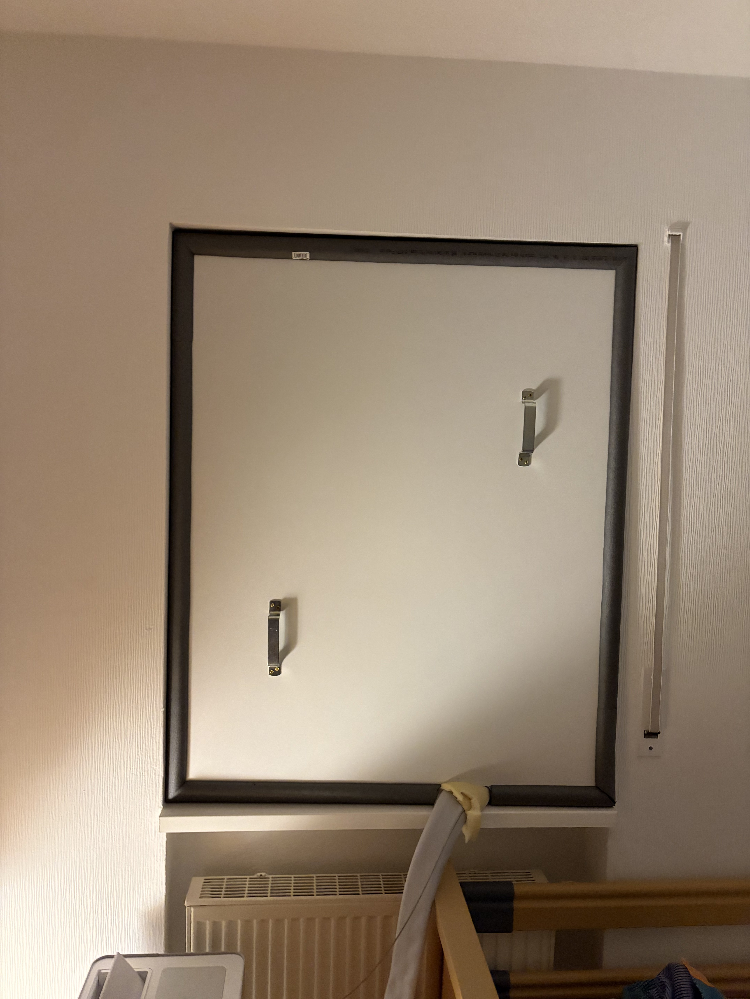

test 123

## Introduction

This project was not simply about making a room quieter. It was about creating a quiet, temperature-stable environment for a person with ME/CFS — while the person who needed the quietest possible room had to remain in that room throughout the construction.

That changes almost everything about how the project needs to be planned.

## 1. Why Sound Isolation Matters So Much with ME/CFS

- Why everyday household and outdoor sounds can become a significant burden.
- The importance of having a quiet and predictable environment.
- Why the person may not be able to simply move to another room during the work.

## 2. The Unusual Challenge: Renovating a Room You Cannot Leave

- The person affected by ME/CFS may be unable to temporarily relocate.
- Noise, dust, smells, vibration, and temperature changes can all become part of the problem.
- The entire project therefore needs to be planned differently from a normal renovation.

## 3. What We Were Trying to Achieve

- Reduce outside noise as much as realistically possible.
- Keep the room at a stable temperature.
- Continue using the air conditioner.
- Avoid creating new sources of noise inside the room.
- Build a solution that requires as little ongoing maintenance as possible.

## 4. The Biggest Weak Point: The Window

- Why windows are often the weakest acoustic point in a room.
- Sound transmission through the glass, frame, seals, and gaps.
- The additional challenge of needing an opening for the air conditioner.

## 5. The AC Problem

- Why simply closing the window is not enough.
- How the AC exhaust creates both an acoustic and thermal weak point.
- The different options:
    - Portable AC
    - Window AC
    - Dual-hose portable AC
    - Split AC
- Why some AC systems are much easier to isolate acoustically than others.

## 6. Planning the Build Around the Person in the Room

- Prepare materials and tools before starting.
- Do everything possible outside the room.
- Don't drill, try to make the isolation as tight as possible so you can just squeeze it in.
- Plan quiet periods and recovery time.

## 7. Building the Sound-Isolated Window

- The actual construction process.
- Sealing gaps and cracks.
- Adding mass
- Creating an airtight passage for the AC.
- Isolating the structure from vibration. - Stichwort entkoppeln
- Explaining what each layer contributes to the final result.

## 8. Sound Isolation vs. Sound Absorption

An important distinction:

- Curtains, carpets, and acoustic panels can reduce reverberation **inside the room**.
- They do not necessarily prevent outside noise from entering.
- Reducing sound transmission relies primarily on things such as mass, airtightness, separation, and decoupling.

## 9. Keeping the Temperature Stable

- How sound-isolation measures interact with the AC.
- Preventing warm outside air from leaking back into the room.
- Reducing drafts and thermal weak points.
- Avoiding excessive temperature fluctuations caused by the AC constantly cycling on and off.

## 10. The Sounds We Didn't Expect

- AC vibration.
- Noise transmitted through the walls or building structure.

## 11. What Worked — and What Didn't

- Compare the situation before and after the project.
- Which interventions made the biggest difference?
- What mistakes did we make?
- What would we do differently next time?
- Where was money well spent?
- Which seemingly obvious solutions turned out to be surprisingly ineffective?

## 12. Living with the Finished Setup

- What the room sounds like now.
- How the AC behaves.
- How stable the temperature actually is.
- Whether the room is now a more reliable environment for rest.
- How much maintenance the solution requires.

## 13. What We Learned

- Start with the biggest acoustic weak point.
- Seal gaps before spending large amounts of money on additional materials.
- Don't forget vibration.
- Design the construction process around the person's energy limitations, not just the technical requirements of the project.
- A technically excellent sound-isolation solution isn't truly useful if building it causes an intolerable amount of disruption.

## The Central Idea

> The goal wasn't simply to make a room quieter. It was to create a quiet, temperature-stable refuge — while the person who needed that room the most couldn't leave it during the entire construction process.
